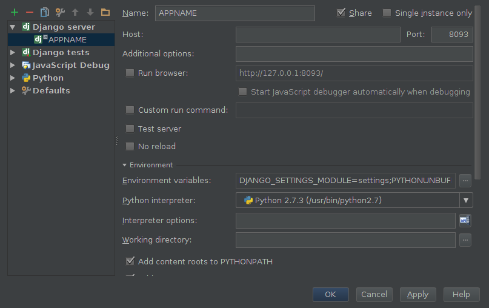

# Development

## IDE

No matter what IDE you use, take your time to learn and configure it properly. We started with [Eclipse](http://www.eclipse.org/) and the [PyDev](http://pydev.org/) plugin and moved to [PyCharm](http://www.jetbrains.com/pycharm/) after some years. The main reason were the powerful Javascritp development tools in PyCharm. Pycharm contains all the features from the popular [Webstorm IDE](http://www.jetbrains.com/webstorm/).

### Code Style and Code Quality Tools

1. Use config files for linters and hinters like [JSHint](http://www.jshint.com/) (.jshintrc) if possible. They can be used by your IDE and build tools like grunt scripts.
1. Share the code style and code quality tool profiles and add them to your SCM.

## Debug

### Django

Create and share a _Django server_ Run/Debug configuration for your django project.

### AngularJS

Install the [JetBrains Chrome Extension](JetBrains Chrome Extension) and start a JavaScript Debug Session.